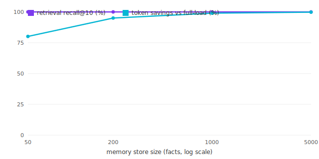

# Effectiveness study — results

> Auto-generated by `eval/run-study.mjs`. Deterministic, LLM-free, no secrets.
> Latest run: **2026-06-26** (`2ce78c5`).

**Claim under test:** as the memory store grows, BM25 retrieval keeps recall high
while the cost of loading the *entire* store into context grows without bound — so
a tiered, retrieval-first design beats an always-loaded index.

## Latest run

| facts | probes | recall@5 | recall@10 | full-load tokens | retrieved tokens (avg, top-10) | token savings |
|---:|---:|---:|---:|---:|---:|---:|
| 50 | 50 | 1 | 1 | 579 | 115 | 80.14% |
| 200 | 200 | 1 | 1 | 2,400 | 119 | 95.04% |
| 1000 | 200 | 1 | 1 | 11,974 | 119 | 99.01% |
| 5000 | 200 | 1 | 1 | 60,476 | 120 | 99.8% |

Read it as: at 5,000 facts, retrieving the top 10 finds the answer
100.0% of the time while using **99.8%** fewer tokens
than loading everything. The always-loaded cost is the "full-load tokens" column; it grows
linearly with the store, the retrieved cost stays flat.

## Headline history (max-N per run)

| date | sha | max facts | recall@10 | token savings |
|---|---|---:|---:|---:|
| 2026-06-26 | initial | 5,000 | 1 | 99.8% |
| 2026-06-26 | 2ce78c5 | 5,000 | 1 | 99.8% |
